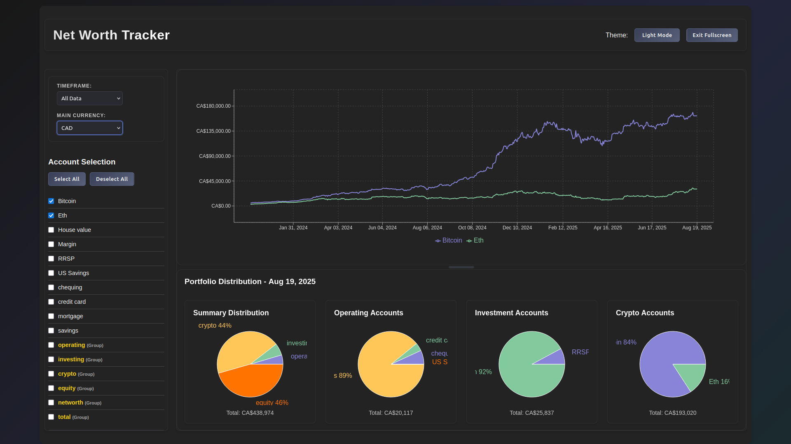

# Net Worth Tracker



A comprehensive financial tracking application for monitoring net worth, investments, and financial portfolios. Available in both Python (PyQt6) and Web (React + Node.js) versions.

## Features

### Core Features
- **Interactive Charts**: Line charts for net worth tracking with clickable data points
- **Pie Charts**: Portfolio distribution visualization for different account types
- **Account Management**: Select/deselect accounts for analysis
- **Data Import**: Import Excel/ODS files with drag-and-drop support
- **Currency Support**: Multiple currency support with conversion
- **Stock/Crypto Ticker Support**: Track balances in shares/units and price them daily using market data
- **Time Filtering**: Custom date ranges and predefined timeframes
- **Real-time Updates**: Dynamic chart updates based on selections
- **Caching**: Fast repeated queries with automatic cache invalidation on data import

### Account Types
- **Operating**: Checking, savings, credit cards
- **Investing**: RRSP, margin accounts
- **Crypto**: Bitcoin, Ethereum, and other cryptocurrencies
- **Equity**: Mortgages, property values
- **Summary**: Overall portfolio distribution

## Python Version (PyQt6)

### Requirements
- Python 3.8+
- PyQt6
- pandas
- matplotlib
- sqlite3

### Installation
```bash
# Install dependencies
pip install PyQt6 pandas matplotlib

# Run the application
python main.py
```

### Features
- Desktop application with native UI
- Interactive matplotlib charts
- SQLite database storage
- Excel/ODS file import
- Real-time data processing
- Currency conversion and ticker pricing
- Interpolated/fill logic for missing dates

## Web Version (React + Node.js)

### Requirements
- Node.js 16+
- npm or yarn

### Installation

1. **Install dependencies:**
```bash
# Install server dependencies
npm install

# Install client dependencies
cd client
npm install
cd ..
```

2. **Start the development server:**
```bash
# Start both server and client (recommended)
npm run dev

# Or start them separately:
npm run server    # Backend on port 5000
npm run client    # Frontend on port 3000
```

3. **Build for production:**
```bash
npm run build
npm start
```

### Features
- Modern web interface with dark theme
- Responsive design for mobile/desktop
- Interactive Recharts visualizations
- Drag-and-drop file upload
- RESTful API backend
- SQLite database with Node.js
- Currency and ticker support
- Fast chart rendering with caching and optimized backend

## Data Format

Both versions support importing Excel/ODS files with the following structure:

| Column   | Description                | Example      |
|----------|----------------------------|--------------|
| Account  | Account name               | "chequing"   |
| Date     | Date (YYYY-MM-DD)          | "2024-01-15" |
| Balance  | Amount (number or shares)  | 5000.00      |
| Currency | Currency code              | "CAD"        |
| Ticker   | Stock/crypto ticker (opt.) | "AAPL"       |

### File Structure
- Each sheet represents an account
- First row contains column headers
- Data starts from second row
- Supported formats: .xlsx, .xls, .ods, .csv

## API Endpoints (Web Version)

### GET `/api/accounts`
Get all available accounts

### GET `/api/balances`
Get account balances with optional filtering
- `startDate`: Start date filter
- `endDate`: End date filter  
- `accounts`: Comma-separated account names
- `currency`: Target currency for conversion

### GET `/api/pie-chart/:type`
Get pie chart data for specific account type
- `type`: operating, investing, crypto, equity, summary
- `date`: Date for pie chart data

### POST `/api/import`
Upload Excel/ODS file for data import

### GET `/api/currencies`
Get available currencies

### PUT `/api/currency`
Update main currency

## Recent Optimizations & Logic

### Backend Logic
- **Caching**: Results of balance queries are cached in-memory and invalidated on new data import or balance addition.
- **Interpolation & Fill**: For each account/currency/ticker series, missing dates between first and last known are filled:
  - Non-ticker: Linear interpolation between known points.
  - Ticker: Step/forward-fill (shares/units constant until next entry).
  - No backward fill before first known date; no forward fill after last known date.
- **Ticker Pricing**: For accounts with tickers, daily values are computed as (shares/units) × (last known price on or before that date).
- **Currency Conversion**: All balances are converted to the requested currency using memoized FX rates for speed.
- **Group Totals**: Group (e.g., investing, crypto) totals are computed after per-account totals for efficiency.

### Frontend Logic
- **Chart Data Shape**: Line charts expect `{ date, Account1, Account2, ... }` objects; pie charts expect `{ labels, data, total }`.
- **Date Range**: Only dates with real data for each account are shown; no extension before first entry.
- **Fullscreen Toggle**: Added to header for improved UX.
- **Error Handling**: Guards for missing balances, undefined accounts, and empty data.

### Troubleshooting
- If charts show unexpected dips or gaps, check:
  - DB for missing dates or prices
  - FX/ticker rates for those dates
  - Data import format (see above)
- If performance is slow, verify caching is enabled and not invalidated too frequently.

## File Structure

```
net-worth-tracker/
├── main.py                 # Python app entry point
├── controller.py           # Python app controller
├── model.py                # Python app data model
├── view.py                 # Python app UI
├── exchange_rates.py       # Exchange rate handling
├── stocks.py               # Stock price handling
├── package.json            # Web app dependencies
├── server/
│   ├── index.js            # Express server
│   └── database.js         # Database operations
├── client/
│   ├── package.json        # React dependencies
│   ├── public/
│   └── src/
│       ├── App.js          # Main React component
│       ├── components/     # React components
│       └── index.css       # Styling
└── config/                 # Configuration files
```

## Contributing

1. Fork the repository
2. Create a feature branch
3. Make your changes
4. Test thoroughly
5. Submit a pull request

## License

MIT License - see LICENSE file for details.