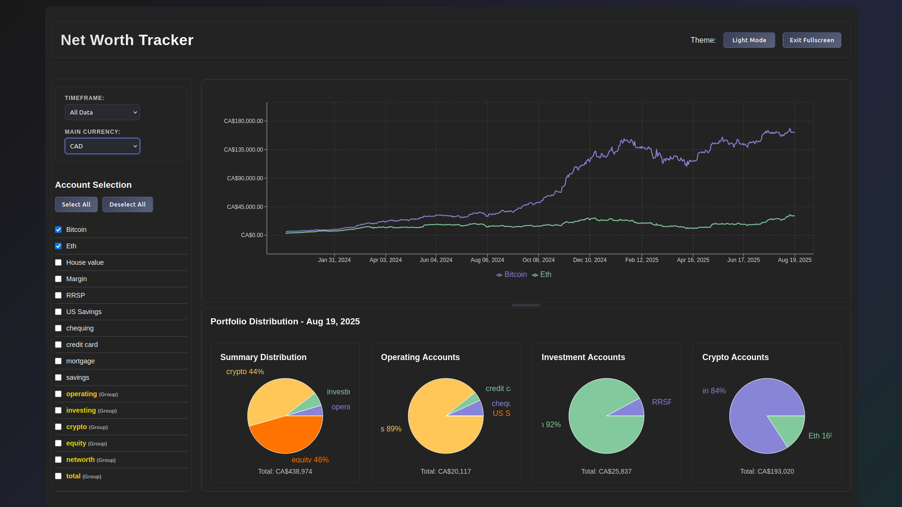

# Net Worth Tracker



A comprehensive financial tracking application for monitoring net worth, investments, and financial portfolios. Available in both Web (React + Node.js) and Python (PyQt6) versions.

## Quick Start

<table>
<tr>
<th width="50%">🐳 Docker (Recommended)</th>
<th width="50%">💻 Local Development</th>
</tr>
<tr>
<td>

No code download required.

```bash
curl -O https://raw.githubusercontent.com/jheffel/net-worth-tracker/main/docker-compose.yml
docker compose up -d
```

Opens at **http://localhost:5000/**.

**Update:** `docker compose pull && docker compose up -d`

</td>
<td>

Requires Node.js 16+.

```bash
npm run install-all
npm run dev
```

Opens at **http://localhost:3000/** (backend proxied).

**Build for production:** `npm run build && npm start`

</td>
</tr>
</table>

### How It Works

- **Single container**: The Docker image serves both the React frontend and the Express API from port 5000.
- **Data persists** across restarts via the `db_data` volume mounted at `/app/db/`.
- **No cron jobs**: Market data (stock prices, crypto rates, FX) is fetched lazily on-demand when you view your portfolio and cached in SQLite.
- **No API keys**: Uses Yahoo Finance for stocks & crypto, Frankfurter for FX rates.
- **Auto-detection**: Stock vs crypto is automatic — no hardcoded lists needed.

## Features

### Core Features
- **Interactive Charts**: Line charts for net worth tracking with clickable data points
- **Pie Charts**: Portfolio distribution visualization for different account types
- **Account Management**: Select/deselect accounts for analysis
- **Data Import**: Import Excel/ODS files with drag-and-drop support
- **Currency Support**: Multiple currency support with conversion
- **Stock/Crypto Ticker Support**: Track balances in shares/units and price them daily using market data
- **Time Filtering**: Custom date ranges and predefined timeframes
- **Real-time Updates**: Dynamic chart updates based on selections
- **Caching**: Fast repeated queries with automatic cache invalidation on data import

### Account Types

You can create any account types you want. Each account holds a balance with a **currency** (e.g. CAD, USD, BTC) and optionally a **ticker** for stocks/ETFs (e.g. AAPL, VEQT.TO). The system automatically looks up market prices for any currency or ticker you add.

The examples below are just sample groupings — your actual accounts depend on what you track:

- **Operating**: Checking, savings, credit cards (currency: CAD/USD, no ticker)
- **Investing**: RRSP, margin accounts (currency: any, with stock/ETF tickers)
- **Crypto**: Bitcoin, Ethereum, altcoins (currency: BTC/ETH/etc., no ticker)
- **Equity**: Mortgages, property values (currency: CAD, no ticker)

## Web Version (React + Node.js)

### Local Development

1. **Install dependencies:**
```bash
# Install server + client dependencies (recommended)
npm run install-all

# Alternative: install server then client manually
npm install
cd client
npm install
cd ..
```

Note: `react-router-dom` is listed in `client/package.json`, so running the client install above will install it. If you add new imports or packages to the client code manually, run `cd client && npm install <pkg>` to add them.

2. **Start the development server:**
```bash
# Start both server and client (recommended)
npm run dev

# Or start them separately:
npm run server    # Backend on port 5000
npm run client    # Frontend on port 3000
```

Notes about `npm run dev`:
- The root `dev` script runs the server and client concurrently and opens your browser at `http://localhost:3000`.
- If the browser opens too early, set `DEV_OPEN_DELAY` before running:

PowerShell example:
```powershell
$env:DEV_OPEN_DELAY=6000; npm run dev
```

On macOS / Linux:
```bash
DEV_OPEN_DELAY=6000 npm run dev
```

3. **Build for production:**
```bash
npm run build
npm start
```

### Features
- Modern web interface with dark theme
- Responsive design for mobile/desktop
- Interactive Recharts visualizations (line charts with velocity overlay, pie charts)
- Drag-and-drop file upload
- RESTful API backend
- SQLite database with Node.js
- Currency and ticker support (free APIs, no keys needed)
- Fast chart rendering with caching and optimized backend

## Data Format

Both versions support importing Excel/ODS files with the following structure:

| Column   | Description                | Example      |
|----------|----------------------------|--------------|
| Account  | Account name               | "chequing"   |
| Date     | Date (YYYY-MM-DD)          | "2024-01-15" |
| Balance  | Amount (number or shares)  | 5000.00      |
| Currency | Currency code              | "CAD"        |
| Ticker   | Stock/crypto ticker (opt.) | "AAPL"       |

### File Structure
- Each sheet represents an account
- First row contains column headers
- Data starts from second row
- Supported formats: .xlsx, .xls, .ods, .csv

## API Endpoints (Web Version)

### GET `/api/accounts`
Get all available accounts

### GET `/api/balances`
Get account balances with optional filtering
- `startDate`: Start date filter
- `endDate`: End date filter  
- `accounts`: Comma-separated account names
- `currency`: Target currency for conversion

### GET `/api/pie-chart/:type`
Get pie chart data for specific account type
- `type`: operating, investing, crypto, equity, summary
- `date`: Date for pie chart data

### POST `/api/import`
Upload Excel/ODS file for data import

### GET `/api/currencies`
Get available currencies

### PUT `/api/currency`
Update main currency

## Recent Optimizations & Logic

### Backend Logic
- **Caching**: Results of balance queries are cached in-memory and invalidated on new data import or balance addition.
- **Interpolation & Fill**: For each account/currency/ticker series, missing dates between first and last known are filled:
  - Non-ticker: Linear interpolation between known points.
  - Ticker: Step/forward-fill (shares/units constant until next entry).
  - No backward fill before first known date; no forward fill after last known date.
- **Ticker Pricing**: For accounts with tickers, daily values are computed as (shares/units) × (last known price on or before that date).
- **Currency Conversion**: All balances are converted to the requested currency using memoized FX rates for speed.
- **Group Totals**: Group (e.g., investing, crypto) totals are computed after per-account totals for efficiency.

### Frontend Logic
- **Chart Data Shape**: Line charts expect `{ date, Account1, Account2, ... }` objects; pie charts expect `{ labels, data, total }`.
- **Date Range**: Only dates with real data for each account are shown; no extension before first entry.
- **Fullscreen Toggle**: Added to header for improved UX.
- **Error Handling**: Guards for missing balances, undefined accounts, and empty data.

### Troubleshooting
- If charts show unexpected dips or gaps, check:
  - DB for missing dates or prices
  - FX/ticker rates for those dates
  - Data import format (see above)
- If performance is slow, verify caching is enabled and not invalidated too frequently.

## File Structure

```
net-worth-tracker/
├── main.py                 # Python app entry point
├── controller.py           # Python app controller
├── model.py                # Python app data model
├── view.py                 # Python app UI
├── exchange_rates.py       # Exchange rate handling
├── stocks.py               # Stock price handling
├── package.json            # Web app dependencies
├── Dockerfile.backend      # Multi-stage Docker build (React + Node)
├── docker-compose.yml      # Single-service Docker Compose config
├── .dockerignore           # Excludes node_modules from Docker context
├── server/
│   ├── index.js            # Express server (API + static files)
│   ├── database.js         # Database operations
│   ├── fetchPrices.js      # Lazy on-demand price fetcher (Yahoo, Frankfurter)
│   ├── fx.js               # FX rate handling with caching
│   ├── stocks.js           # Stock price handling with caching
│   └── middleware/
│       └── auth.js         # JWT authentication middleware
├── client/
│   ├── package.json        # React dependencies
│   ├── public/
│   └── src/
│       ├── App.js          # Main React component
│       ├── index.js        # React entry point
│       ├── context/
│       │   └── AuthContext.js  # Authentication context
│       ├── utils/
│       │   └── fx.js       # Client-side FX utilities
│       ├── components/     # React components
│       └── index.css       # Styling
├── scripts/                # Utility scripts
└── config/                 # Configuration files
```

## Contributing

1. Fork the repository
2. Create a feature branch
3. Make your changes
4. Test thoroughly
5. Submit a pull request

## License

This program is free software: you can redistribute it and/or modify it under the terms of the GNU Affero General Public License as published by the Free Software Foundation, either version 3 of the License, or (at your option) any later version.

**Commercial use:** If you wish to use this software in a proprietary commercial product or hosted service without complying with the AGPL's source-code disclosure requirements, a commercial license is available. Contact the author for details.

See the [LICENSE](LICENSE) file for the full AGPLv3 text.